# Kiteworks MCP Server

The Kiteworks MCP Server enables Large Language Model (LLM) applications to securely interact with your Kiteworks instance through the Model Context Protocol (MCP). This cross-platform server provides AI assistants with the ability to manage files, folders, and user information within your Kiteworks environment while maintaining enterprise-grade security.

**Key Capabilities:**
- **File Management:** Upload, download, and retrieve metadata for files stored in Kiteworks
- **Folder Operations:** Navigate folder hierarchies, create new folders, and manage folder structures
- **User Information:** Access current user details and authentication status
- **OAuth 2.0 Authentication:** Secure authorization with refresh token support
- **Rate Limiting:** Built-in protection with configurable request limits
- **Cross-Platform Support:** Native binaries for Windows, Linux, and macOS

Built as a local STDIO-based server, it runs per user on their machine, connecting LLM clients to Kiteworks through secure OAuth 2.0 authentication.

## Security considerations

This MCP server may handle sensitive data, which will be accessible to the LLM you attach.
Make sure you only install MCP Servers that are trusted and verified.

The Kiteworks MCP Server does not expose credentials or security tokens to the LLM. They are securely stored in your operating system keychain/credentials store.

The Kiteworks MCP Server does not make the data it transfers available to the LLM (in the LLM context).
In addition, by default absolute paths are not allowed for upload or for storing downloaded content.  You will not be able to upload /etc/passwd or download to /etc/passwd. To allow absolute paths, consult the command line options.

The Kiteworks MCP Server validates the TLS certificate of the remote Kiteworks server it connects to.
It will abort if it can't be validated, to protect against man in the middle attacks.
If your Kiteworks instance uses a self-signed certificate or a certificate from an unknown certificate authority, you can supply the Root CA chain using a command line option.
		

## Installation & setup

### Kiteworks
**IMPORTANT**: before you can start, you need to set up a custom OAuth application in the Kiteworks Admin UI. Navigate to Application Setup -> Clients and Plugins -> API.
Ensure the OAuth application has the following scopes:
- Files: `CREATE`,`READ`
- Folders: `CREATE`,`READ`
- Users: `READ`

Further, ensure you have 
- `Authorization Code` flow enabled
- `Refresh Token` enabled
- redirect URI set to `http://localhost:9999/callback`

Save the provided `Client Application ID` and `Client Secret Key` in a secure place. You will need to enter them on the first run of the MCP Server.

### Windows Client

Download the binary for Windows.

Initiate setup (one-time OAuth flow):
```bash
C:\Path\To\kiteworks-mcp.exe setup https://your.kiteworks.domain
```

**Claude Code** setup
```bash
claude mcp add --transport stdio kiteworks C:\Path\To\kiteworks-mcp.exe start https://your.kiteworks.domain
```

### MacOS Client

Download the binary for MacOS.

Initiate setup (one-time OAuth flow):
```bash
/Path/To/kiteworks-mcp setup https://your.kiteworks.domain
```

**Claude Code** setup

```bash
claude mcp add --transport stdio kiteworks /Path/To/kiteworks-mcp start https://your.kiteworks.domain
```

### Linux Client

The instructions are the same as for MacOS.

NOTE: The Linux implementation depends on the Secret Service dbus interface, which is provided by GNOME Keyring (https://wiki.gnome.org/Projects/GnomeKeyring).

---
### Visual Studio Code
For instruction on setting up MCP Servers in VS Code, you can refer to this article: https://code.visualstudio.com/docs/copilot/customization/mcp-servers

### MCP Inspector
- Command: /Path/To/kiteworks-mcp
- Arguments: start https://your.kiteworks.domain
- Transport: STDIO

## A sample json configuration
```
kiteworks-mcp start --insecure-absolute-paths --ca-cert path_to_cert/ca_chain.pem https://your.kiteworks.domain
```
Translates to a Claude Desktop json:
```json
{
  "mcpServers": {
    "kiteworks": {
      "command": "path_to/kiteworks-mcp",
      "args": [
        "start",
        "--insecure-absolute-paths",
        "--ca-cert",
        "path_to_cert/ca_chain.pem",
        "https://your.kiteworks.domain"
      ]
    }
  }
}
```

## Command Reference

The Kiteworks MCP Server provides the following commands:

### setup
Set up Kiteworks connection (one-time OAuth authentication).

```bash
kiteworks-mcp setup [flags] <kiteworks URL>
```

**Flags:**
- `--port, -p <port>`: specify different OAuth callback server port in case of conflict (default: 9999, range: 1024-65535)
- `--ca-cert, -c <path>`: Path to custom CA certificate in PEM format

**Example:**
```bash
kiteworks-mcp setup https://your.kiteworks.domain
kiteworks-mcp setup --port 8080 --ca-cert /path/to/ca_chain.pem https://your.kiteworks.domain
```

### start
Run the MCP Server (requires prior setup).

```bash
kiteworks-mcp start [flags] <Kiteworks URL>
```

**Flags:**
- `--port, -p <port>`: specify different OAuth callback server port in case of conflict (default: 9999, range: 1024-65535)
- `--ca-cert, -c <path>`: Path to custom CA certificate in PEM format
- `--insecure-absolute-paths`: allow absolute file paths in operations (insecure)

**Example:**
```bash
kiteworks-mcp start https://your.kiteworks.domain
kiteworks-mcp start --ca-cert /path/to/ca_chain.pem https://your.kiteworks.domain
kiteworks-mcp start --insecure-absolute-paths https://your.kiteworks.domain
```

### remove
Delete all stored credentials and tokens for a Kiteworks server.

```bash
kiteworks-mcp remove <Kiteworks URL>
```

**Example:**
```bash
kiteworks-mcp remove https://your.kiteworks.domain
```

### version
Print version information.

```bash
kiteworks-mcp version
```

## TLS Certificate Verification

If your Kiteworks instance uses a self-signed certificate or a certificate from an unknown certificate authority, you may encounter TLS verification errors during OAuth authentication. You can supply the Root CA chain using the `--ca-cert` (or `-c`) flag:

```bash
kiteworks-mcp setup --ca-cert ca_cert_chain.pem https://your.kiteworks.domain
kiteworks-mcp start --ca-cert ca_cert_chain.pem https://your.kiteworks.domain
```

**Note:** The CA certificate must be in PEM format and contain the complete certificate chain.

## Absolute Path Access

By default, for additional security, the MCP Server restricts file operations to relative paths only. Uploads and Downloads will use the current working directory of the MCP Client.
You can enable full file system access using the `--insecure-absolute-paths` flag of the "start" command.

When enabled, file operations can access:
- Full system directories: `/home/user/documents/file.txt`
- Root filesystem access: `/etc/passwd`, `/var/log/system.log`
- Windows system paths: `C:\Windows\System32\config.txt`

**Examples with absolute paths:**
```bash
# Upload from absolute path
upload_file(parent_id="folder123", source="/Users/john/Desktop/report.pdf")

# Download to absolute path
download_file(file_id="file456", target="C:\Users\jane\Documents\downloaded.xlsx")
```


## Quick Start Guide for macOS users

#### OAuth Application

Create a custom OAuth application in your Admin Console:

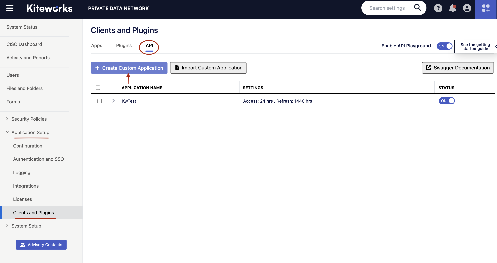

Ensure that:
- redirect URI is set to `http://localhost:9999/callback`
- `Authorization Code` flow is enabled
- `Refresh Token` is enabled

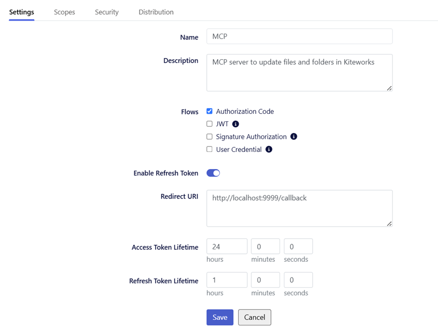

Ensure the OAuth application has at least the following scopes for basic functionality:
- `READ` and `CREATE` Folders
- `READ` and `CREATE` Files
- `READ` Users

Save the provided `Client Application ID` and `Client Secret Key` in a
secure place:

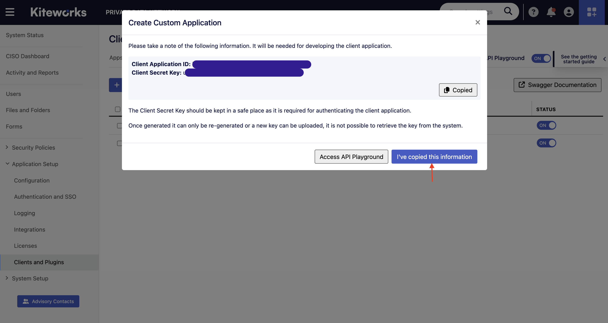

If the Custom Application is created successfully, it appears in the list
of available applications:

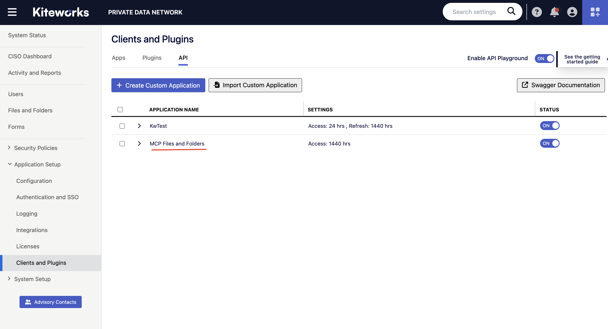

#### Authenticate the OAuth Client

[Download](https://content.kiteworks.com/web/folder/feb83180-fb53-46ee-af2b-5427b2c88175) the latest
darwin-based Kiteworks MCP server binary for macOS.

Authenticate previously created OAuth application:

```bash
<FOLDER_WITH_MCP_BINARY>/kiteworks-mcp setup https://your.kiteworks.domain
```

If the command above executes successfully, the browser opens automatically. Login to your
Kiteworks box and grant access to the Custom Application:

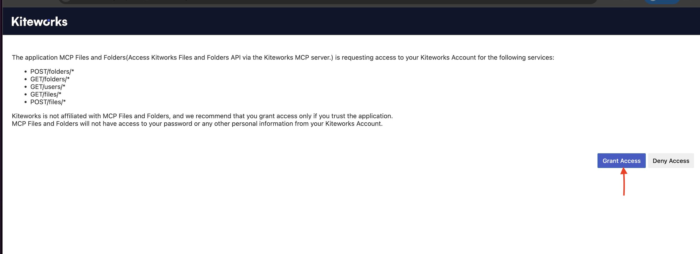

#### Run Kiteworks MCP server with MCP Inspector

MCP Inspector is a convenient tool to investigate an MCP server functionality.

Ensure that [node.js](https://formulae.brew.sh/formula/node) v18+ is installed.

Start the MCP inspector (the browser opens automatically):

```bash
npx @modelcontextprotocol/inspector
```

In the opened MCP Inspector window, ensure that:

* Transport Type is `STDIO`.
* Command is a path to `kiteworks-mcp` binary.
* Arguments are `start https://your.kiteworks.domain`.

Press `"Connect"` button and get access to the list of prompts, tools and resources available
at Kiteworks MCP server:

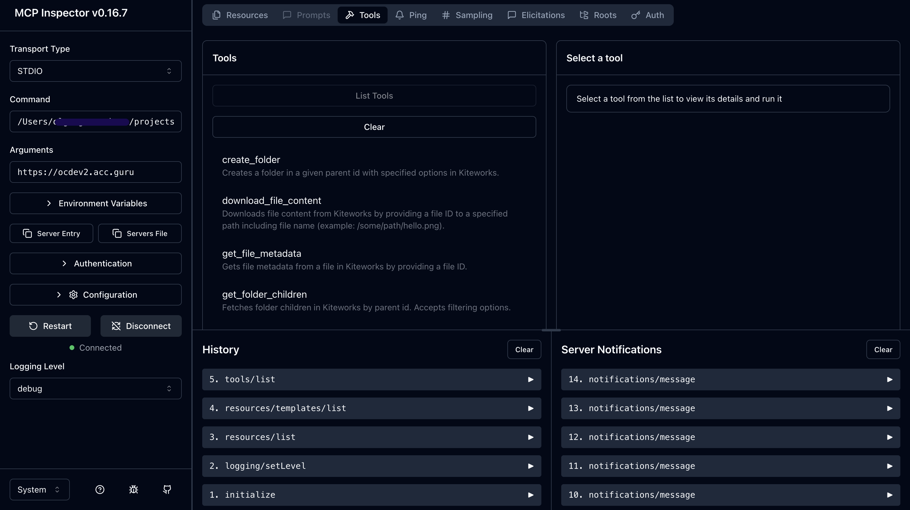

#### Configure MCP Client

The customer needs to bring their own MCP Client and an LLM to be able to work with Kiteworks MCP server. 
There can be different combinations of MCP Client and LLM, and in this guide we will describe two
possible combinations:

* Claude Desktop
* Claude Code with AWS Bedrock

<span style="color: red;"><strong>⚠️ Disclaimer on Large Language Model (LLM) Integration</strong></span>

> <strong>Important:</strong> Customers are responsible for selecting and configuring their own MCP Client and LLM.  
> 
> 1. The chosen LLM must align with the customer’s internal compliance policies, security requirements,
> and data handling guidelines.  
> 2. Please be aware that different LLM providers offer varying levels of data privacy and security.
> Some providers may retain, log, or use input data for training or other purposes.  
> 3. <strong>Kiteworks</strong> provides guidance on LLM integration but assumes no responsibility or 
> liability for any data exposure, compliance breaches, or other risks resulting from the use of 
> third-party LLM services.


##### Configure Claude Desktop

Prerequisites:

* Claude Desktop installed.

> **_NOTE:_**  Claude Desktop has preconfigured LLMs provided by Anthropic.
> The customer has to ensure that usage of public Anthropic LLMs is allowed
> within their organization (see the Disclaimer above).

Open Claude Desktop settings and press "Edit Config".

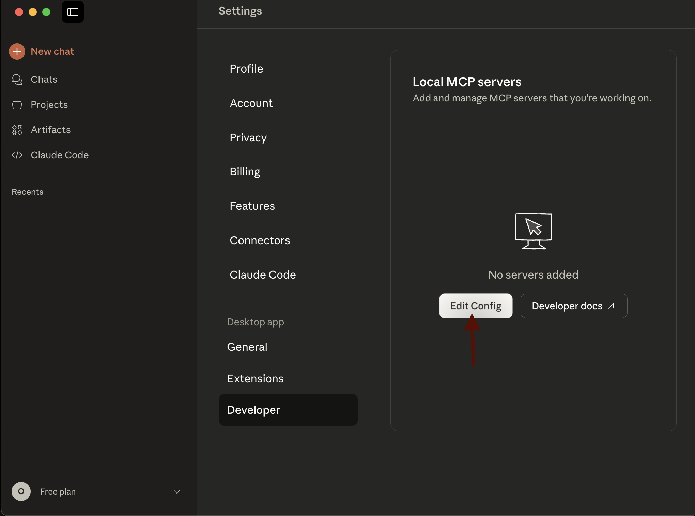


Include in the provided JSON configuration file the following:

```json
{
  "mcpServers": {
    "kiteworks": {
      "command": "<FOLDER_WITH_MCP_BINARY>/kiteworks-mcp",
      "args": [
        "start",
        "https://your.kiteworks.domain"
      ]
    }
  }
}
```

To allow full file system access use the `--insecure-absolute-paths` flag
```json
{
  "mcpServers": {
    "kiteworks": {
      "command": "<FOLDER_WITH_MCP_BINARY>/kiteworks-mcp",
      "args": [
        "start",
        "--insecure-absolute-paths",
        "https://your.kiteworks.domain"
      ]
    }
  }
}
```

For self-signed certificates, use the `--ca-cert` (or `-c`) flag:

```json
{
  "mcpServers": {
    "kiteworks": {
      "command": "<FOLDER_WITH_MCP_BINARY>/kiteworks-mcp",
      "args": [
        "start",
        "--ca-cert",
        "path_to_cert/ca_chain.pem",
        "https://your.kiteworks.domain"
      ]
    }
  }
}
```
**Important:** Restart Claude Desktop to pick up the new configuration. The browser
opens automatically. Login to your Kiteworks box and grant access to the Custom Application.

Verify that Kiteworks MCP server is running:

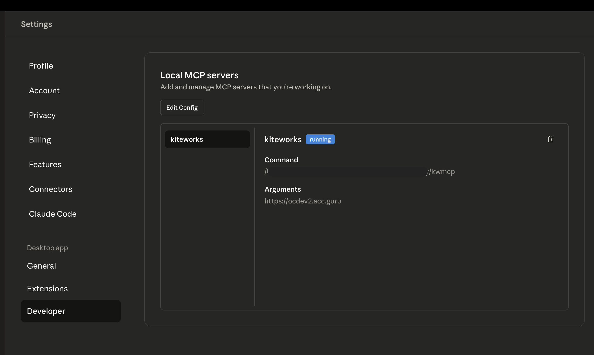

Now let's ask Claude about Kiteworks MCP server functionality:

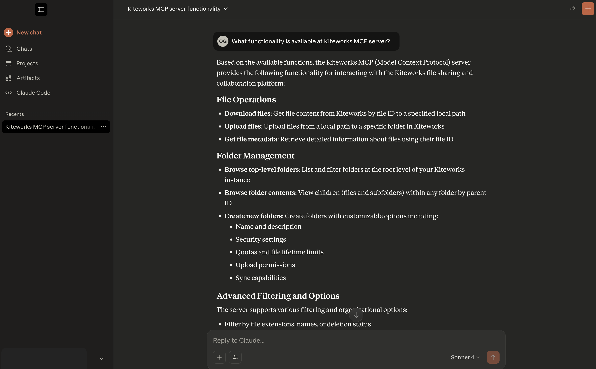


Happy prompting!


##### Configure Claude Code with AWS Bedrock

Prerequisites:

* AWS CLI installed.
* Claude Code installed and authenticated.
* AWS Bedrock access enabled.

It is possible to use LLMs provided by Anthropic together with Claude Code, however, our customers can
also use their own LLMs provided via popular cloud services, e.g. Google Cloud, AWS, MS Azure.

In this example we will use AWS Bedrock as our secure LLM provider. We chose two models from AWS Bedrock:

* Claude Sonnet 4.5 (larger model for deep thinking)
* Claude 3.5 Haiku (smaller model for simple requests)

Activate AWS Bedrock models for Claude Code via the environment variables:

```bash
export CLAUDE_CODE_USE_BEDROCK=1
export AWS_REGION=<YOUR_AWS_REGION>
export ANTHROPIC_MODEL=<CLAUDE_SONNET_4.5_MODEL_ID>
export ANTHROPIC_SMALL_FAST_MODEL=<CLAUDE_3.5_HAIKU_MODEL_ID>
export AWS_PROFILE=<AWS_PROFILE>
```

Add Kiteworks MCP server to the Claude configuration:

```bash
claude mcp add --transport stdio kiteworks <FOLDER_WITH_MCP_BINARY>/kiteworks-mcp start https://your.kiteworks.domain
```

Everything is set up! Run `claude` command and prompt "What can I do with Kiteworks MCP server?"

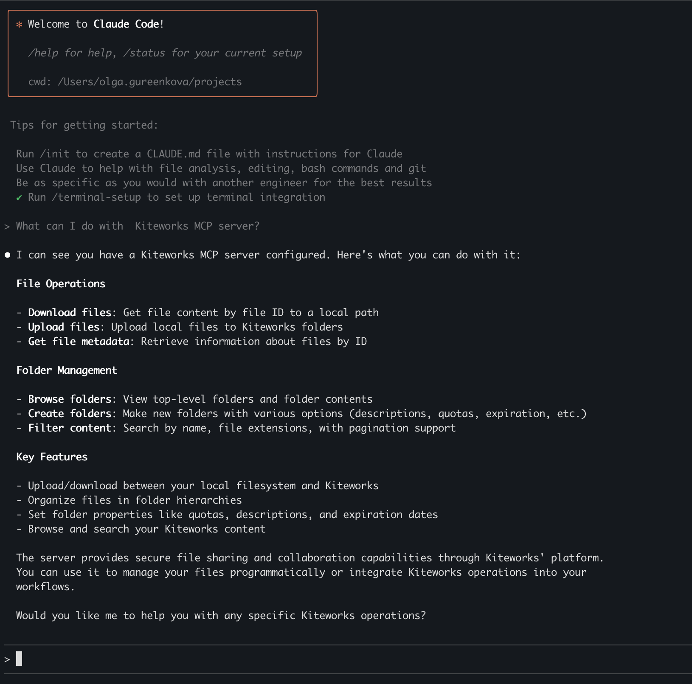

Verify with `/status` prompt that Claude uses AWS Bedrock:

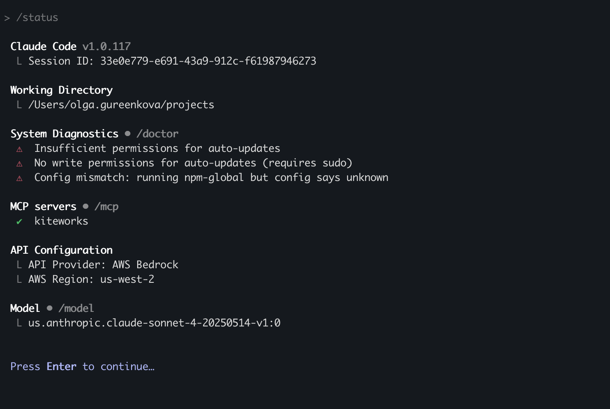


Happy prompting!
